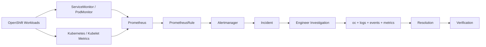

# OpenShift Observability & Incident Monitoring

A practical OpenShift monitoring project built around **Prometheus, User Workload Monitoring, alerting, investigation, and operational runbooks**.

The goal is not just to collect metrics. The project models the workflow an engineer follows during an incident:

**Problem → Monitoring signal → Alert → Investigation → Resolution → Verification**

> This repository is designed as a reproducible observability/incident-monitoring project for an OpenShift lab or development cluster. It does not claim production incidents that were not actually observed.

## What this project demonstrates

- OpenShift User Workload Monitoring configuration
- PrometheusRule-based workload and node health alerts
- CPU and memory saturation detection
- Pod crash/restart and readiness detection
- Node memory/disk pressure signals
- `oc`-based incident investigation
- Alert-specific troubleshooting runbooks
- YAML validation and automated Python tests
- GitHub Actions CI for every push and pull request
- Architecture and evidence documentation

## Architecture



See [`docs/architecture.md`](docs/architecture.md) for the detailed signal flow.

## Repository structure

```text
.
├── .github/workflows/
│   └── ci.yml                         # Automated tests + YAML validation
├── cluster-config/
│   ├── user-workload-monitoring.yaml  # Enables UWM
│   └── retention-config.yaml           # Retention/storage configuration
├── manifests/
│   ├── service-monitors/               # ServiceMonitor definitions
│   ├── pod-monitors/                   # PodMonitor definitions
│   └── prometheus-rules/               # Alerting rules
├── docs/
│   ├── architecture.md                 # Monitoring architecture
│   ├── troubleshooting.md              # Incident investigation workflow
│   ├── runbooks/                       # Alert-specific remediation guides
│   └── screenshots/                    # Real cluster evidence captured by the operator
├── tests/
│   └── test_alert_rules.py             # Automated alert-rule validation
├── logs/                               # Sanitized example logs/evidence
├── main.py                             # Local host resource observation helper
└── requirements-dev.txt                # Test dependencies
```

## Quickstart

### 1. Enable User Workload Monitoring

```bash
oc apply -f cluster-config/user-workload-monitoring.yaml
```

Verify the monitoring stack:

```bash
oc get pods -n openshift-user-workload-monitoring
```

### 2. Deploy monitoring rules

```bash
oc apply -f manifests/prometheus-rules/openshift-workload-alerts.yaml
```

If you add a custom application, expose its metrics and create a matching `ServiceMonitor` or `PodMonitor` under `manifests/`.

### 3. Validate the repository locally

```bash
python -m pip install -r requirements-dev.txt
pytest -q
```

GitHub Actions runs the same tests and parses all YAML manifests automatically.

## Alert catalogue

| Alert | Severity | Condition | Runbook |
|---|---|---|---|
| `WorkloadHighCPU` | warning | Sustained pod CPU > 0.8 cores | [high CPU](docs/runbooks/high-cpu.md) |
| `WorkloadHighMemory` | warning | Sustained pod memory > 1 GiB | [high memory](docs/runbooks/high-memory.md) |
| `PodCrashLooping` | critical | ≥3 restarts in 15 minutes | [crashloop](docs/runbooks/pod-crashloop.md) |
| `PodNotReady` | warning | Pod not ready for 10 minutes | [not ready](docs/runbooks/pod-not-ready.md) |
| `NodeMemoryPressure` | critical | Sustained node memory pressure | [node issues](docs/runbooks/node-issues.md) |
| `NodeDiskPressure` | critical | Sustained node disk pressure | [node issues](docs/runbooks/node-issues.md) |

Metric availability can vary by OpenShift version and monitoring-stack configuration. Validate each expression in the target cluster before treating it as a production alert.

## Incident investigation example

### Scenario: application pod starts crashing

**Problem:** users report degraded application behavior.

**Monitoring:** Prometheus detects repeated container restarts.

**Alert:** `PodCrashLooping` fires after the configured threshold.

**Investigation:**

```bash
oc get pod <pod> -n <namespace>
oc describe pod <pod> -n <namespace>
oc logs <pod> -n <namespace> --previous
oc get events -n <namespace> --sort-by=.lastTimestamp
```

**Resolution:** identify and correct the failing configuration, dependency, probe, image, or resource constraint.

**Verification:** confirm the pod remains Ready, restart counts stop increasing, and the alert clears.

The same pattern is documented for CPU, memory, readiness, and node-pressure incidents in [`docs/runbooks/`](docs/runbooks/).

## RBAC notes

Prefer least-privilege access for monitoring operators. Grant only the permissions required for the namespace and monitoring resources being managed. Avoid documenting commands with missing subjects or namespaces; always specify the target user/service account and namespace explicitly.

## Evidence

The repository intentionally does **not** include fabricated screenshots. Capture real evidence from your OpenShift lab and add it to [`docs/screenshots/`](docs/screenshots/). Recommended evidence includes a monitoring dashboard, a fired alert, an incident investigation, node health, and a successful CI run.

## Engineering practices

- Keep manifests declarative and reviewable.
- Give every alert a severity, actionable description, and runbook.
- Test configuration changes before merging.
- Use GitHub Actions as a merge-quality gate.
- Correlate metrics with events and logs before remediation.
- Verify recovery after every incident.

## Project outcome

This project demonstrates an end-to-end **OpenShift observability and incident-response workflow**, combining Kubernetes/OpenShift operations, Prometheus alerting, Linux-style troubleshooting, automation, testing, and CI/CD.
