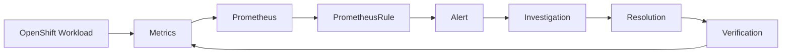

# OpenShift Observability & Incident Monitoring

[](https://github.com/Rohaannnnn/openshift-monitoring-project/actions/workflows/ci.yml)

A hands-on OpenShift observability project focused on **Prometheus alerting, infrastructure monitoring, incident investigation, troubleshooting runbooks, automation, and CI validation**.

> **Project scope:** This repository is designed for an OpenShift lab/development environment. It does not claim production incidents or evidence that has not been captured from a real cluster.

## What this project demonstrates

- OpenShift User Workload Monitoring configuration
- PrometheusRule-based workload and node alerts
- CPU and memory saturation detection
- Pod crash/restart and readiness detection
- Node memory and disk pressure detection
- `oc`-based incident investigation
- Alert-specific troubleshooting runbooks
- Automated Python tests for monitoring rules
- YAML manifest validation
- GitHub Actions CI on pushes and pull requests
- Documentation structured around an incident-response workflow

## Incident workflow

The project follows an operational workflow rather than treating monitoring as isolated YAML:

**Problem → Monitoring Signal → Alert → Investigation → Resolution → Verification**



Detailed architecture is documented in [`docs/architecture.md`](docs/architecture.md).

## Repository Structure

The repository is organized by responsibility so that each part of the project has a clear purpose.

### ⚙️ OpenShift Configuration

| Directory / File | Purpose |
|---|---|
| `cluster-config/` | OpenShift monitoring configuration |
| `cluster-config/user-workload-monitoring.yaml` | Enables User Workload Monitoring |
| `cluster-config/retention-config.yaml` | Optional metrics retention and storage configuration |

### 📊 Monitoring & Alerting

| Directory | Purpose |
|---|---|
| `manifests/service-monitors/` | ServiceMonitor definitions for application metrics |
| `manifests/pod-monitors/` | PodMonitor definitions for direct pod monitoring |
| `manifests/prometheus-rules/` | Prometheus alerting and recording rules |
| `dashboards/grafana-dashboards/` | Grafana dashboard definitions |

### 🚨 Incident Response & Documentation

| Directory / File | Purpose |
|---|---|
| `docs/architecture.md` | Monitoring architecture and component flow |
| `docs/troubleshooting.md` | Standard incident investigation workflow |
| `docs/runbooks/` | Alert-specific troubleshooting procedures |
| `docs/screenshots/` | Real OpenShift evidence captured from the lab |

### 🧪 Testing & Automation

| Directory / File | Purpose |
|---|---|
| `tests/` | Automated validation for monitoring configuration |
| `scripts/` | Linux system monitoring and diagnostic helpers |
| `.github/workflows/ci.yml` | Automated testing and YAML validation |
| `requirements-dev.txt` | Python development/test dependencies |

### 📝 Project Utilities

| File / Directory | Purpose |
|---|---|
| `main.py` | Local system resource observation helper |
| `logs/` | Existing lab log data and diagnostic output |

### Repository at a glance

```text
openshift-monitoring-project/
│
├── .github/workflows/          # CI automation
├── cluster-config/             # OpenShift monitoring configuration
├── manifests/                  # Monitoring resources and alert rules
│   ├── pod-monitors/
│   ├── prometheus-rules/
│   └── service-monitors/
├── dashboards/                 # Grafana dashboards
├── docs/                       # Architecture, troubleshooting and runbooks
│   ├── runbooks/
│   └── screenshots/
├── scripts/                    # Linux monitoring helpers
├── tests/                      # Automated tests
├── logs/                       # Lab diagnostic data
├── main.py                     # Local monitoring utility
├── requirements-dev.txt        # Test dependencies
└── README.md                   # Project documentation
```

## Quick start

### Prerequisites

- Access to an OpenShift cluster
- `oc` CLI configured for the target cluster
- Permission to manage the required monitoring resources
- Python 3.11+ for local validation

### 1. Enable User Workload Monitoring

Review the configuration before applying it to a cluster:

```bash
oc apply -f cluster-config/user-workload-monitoring.yaml
```

Verify the monitoring namespace:

```bash
oc get pods -n openshift-user-workload-monitoring
```

### 2. Apply the alert rules

```bash
oc apply -f manifests/prometheus-rules/openshift-workload-alerts.yaml
```

Verify the rule resource:

```bash
oc get prometheusrules
```

> Resource names, namespaces, and metric availability can vary by OpenShift version and cluster configuration. Validate the manifests in the target lab before using them operationally.

### 3. Optional retention configuration

`cluster-config/retention-config.yaml` is intentionally separate because storage requirements and available StorageClasses vary between clusters. Review and adapt the storage request before applying it.

### 4. Validate locally

```bash
python -m pip install -r requirements-dev.txt
python -m pytest -q
```

GitHub Actions performs the same tests, compiles Python files, and parses YAML manifests for every push and pull request.

## Alert catalogue

| Alert | Severity | Signal | Runbook |
|---|---|---|---|
| `WorkloadHighCPU` | Warning | Sustained pod CPU above threshold | [High CPU](docs/runbooks/high-cpu.md) |
| `WorkloadHighMemory` | Warning | Sustained pod memory above threshold | [High Memory](docs/runbooks/high-memory.md) |
| `PodCrashLooping` | Critical | Repeated container restarts | [CrashLoop](docs/runbooks/pod-crashloop.md) |
| `PodNotReady` | Warning | Pod remains not ready | [Pod Not Ready](docs/runbooks/pod-not-ready.md) |
| `NodeMemoryPressure` | Critical | Node reports memory pressure | [Node Issues](docs/runbooks/node-issues.md) |
| `NodeDiskPressure` | Critical | Node reports disk pressure | [Node Issues](docs/runbooks/node-issues.md) |

Each alert has a severity, actionable annotations, and a corresponding troubleshooting runbook.

## Incident investigation example

### Scenario: a workload starts crashing

**1. Detect** — Prometheus observes repeated container restarts.

**2. Alert** — `PodCrashLooping` fires after the configured threshold.

**3. Investigate** — correlate pod state, events, and previous container logs:

```bash
oc get pod <pod> -n <namespace>
oc describe pod <pod> -n <namespace>
oc logs <pod> -n <namespace> --previous
oc get events -n <namespace> --sort-by=.lastTimestamp
```

**4. Resolve** — correct the failed configuration, dependency, probe, image, or resource constraint.

**5. Verify** — confirm the pod becomes Ready, restart counts stabilize, and the alert clears.

The same approach is documented for CPU, memory, readiness, and node-pressure incidents in [`docs/runbooks/`](docs/runbooks/).

## Testing and CI

The repository uses lightweight automated validation to catch configuration mistakes before changes are merged:

- PrometheusRule structure and expected alert names
- Alert severity and runbook references
- YAML parsing across cluster and application manifests
- Python syntax compilation
- Automated execution through GitHub Actions

## Evidence and screenshots

Real cluster evidence will be added after the manifests are exercised in the OpenShift lab. The repository intentionally contains **no fabricated screenshots**.

Recommended evidence:

1. OpenShift monitoring/workload dashboard
2. Fired alert
3. Pod or node investigation using `oc`
4. Resolution and recovery state
5. Passing GitHub Actions run

See [`docs/screenshots/README.md`](docs/screenshots/README.md) for the evidence checklist.

## Engineering practices

- Keep Kubernetes/OpenShift configuration declarative and reviewable.
- Give alerts clear severity, descriptions, and runbooks.
- Validate configuration before merging.
- Correlate metrics with logs and events during incidents.
- Follow least-privilege principles for monitoring access.
- Verify recovery after remediation.
- Keep production claims separate from lab evidence.

## Project status

**Current:** monitoring configuration, alert rules, runbooks, documentation, tests, and CI are implemented.

**Next:** exercise the manifests against the actual OpenShift lab, capture real evidence, and document the observed results.
