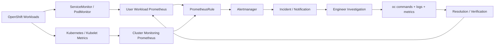

# Observability Architecture

The project follows an incident-oriented monitoring flow rather than treating monitoring as a collection of YAML files.

## Signal flow

1. **Problem:** a workload or node develops abnormal behavior.
2. **Monitoring:** Prometheus collects resource, pod, and node signals.
3. **Alert:** a PrometheusRule evaluates sustained conditions and assigns severity.
4. **Investigation:** the engineer correlates the alert with pod state, events, logs, and node health using `oc`.
5. **Resolution:** the underlying issue is corrected and the same signal is checked again to confirm recovery.

The repository intentionally separates cluster configuration, monitoring manifests, operational runbooks, and automated validation so that an engineer can trace an alert from configuration to remediation.
